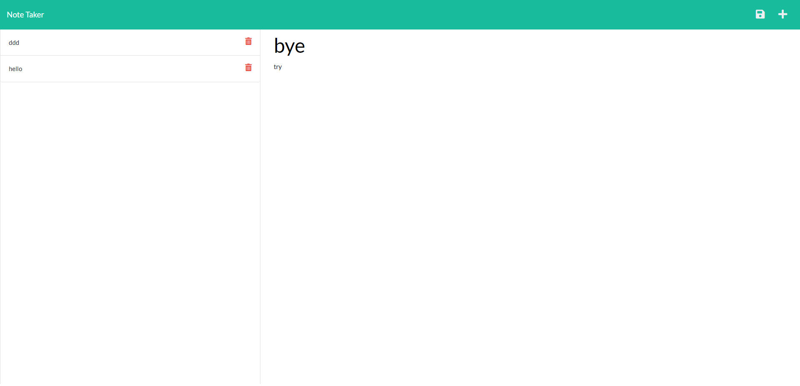

# Note Taker App

## Description
The Note Taker app is a simple web application that allows users to take and manage notes. Users can create new notes, view existing notes.
The application is built using Express.js on the server-side to handle routing and data management, and it utilizes HTML, CSS, and JavaScript on the client-side for the user interface.

[deployed heroku site](https://note-taker-sonamsherpa-8736a151d7bd.herokuapp.com/)

## Installation
To run the Note Taker app locally on your machine, follow these steps:
1.	Clone the repository to your local machine.
2.	Make sure you have Node.js and npm (Node Package Manager) installed.
3.	Open a terminal or command prompt and navigate to the project directory.
4.	Run npm install to install the required dependencies.
5.	Start the application by running npm start or node server.js.
6.	Open your web browser and go to http://localhost:3001 to access the app.

## Usage
*	Home Page: When you access the application, you will be presented with the home page that displays a welcome message and a "Get Started" button. Clicking the "Get Started" button will take you to the notes page.
*	Notes Page: On the notes page, you will see a list of existing notes on the left side and an empty note area on the right side.
*	To view a note, click on the title of the note from the left-hand side list. The content of the selected note will be displayed in the note area.
*	To create a new note, click on the "plus" icon (represented by a "+" symbol) in the navigation bar. This will clear the note area, and you can enter a new note title and content.
*	To save a new or edited note, click on the "save" icon (represented by a floppy disk icon) in the navigation bar. The note will be saved, and it will appear in the list of existing notes on the left side.
*	To delete a note, click on the "trash" icon (represented by a trash can icon) next to the note in the list. The note will be permanently deleted from the application.

## Technologies Used
*	Express.js
*	Node.js
*	HTML
*	CSS
*	JavaScript
*	UUID (for generating unique IDs for notes)

## Contributing
This application was created as part of a coding bootcamp assignment. Currently, it is not open for external contributions. However, you are welcome to fork the repository and modify the code for your own purposes.

## Acknowledgments
*	This app was built as a learning project during a coding bootcamp.
*	The Express.js framework and its contributors.

## Questions
* GitHub: https://github.com/ssherp/Note-Taker
* Email: ssherpa89@gmail.com